# Programming Coursework Smart Home App 💻

A __Smart Home app__ protoype written in __Python__ using __Tkinter__ (Python's Standard Graphical User Interface Package). This was submitted as the second piece of coursework for the first-year Programming module at the University of Portsmouth.

## Overview

The primary objective of this coursework was to develop a prototype GUI app that interacts with smart home objects. The prototype must provide intuitive user interfaces for managing smart devices, toggling their states, and setting device attributes.

## Table of contents

- [Main Features](#main-features)
  - [Fully Interactive GUI ](#fully-interactive-gui )
  - [Interface & Accessibility Settings](#interface-&-accessibility-settings)
  - [Appropriate Error Messages](#Error-Messages)
  - [Permanent Data Storage](#Permanent-Data-Storage)
  - [Device Scheduler](#Device-Scheduler)
- [Requirements](#Requirements)
  - [If On Mac](#If-ran-on-Mac)
  - [Installation](#Installation)
- [Usage](#usage)
  - [Input](#Input)

## Main Features

### Fully Interactive GUI 

A fully interactive and working app where you can add, edit and remove devices from your 'Smart Home'.

#### Main Menu
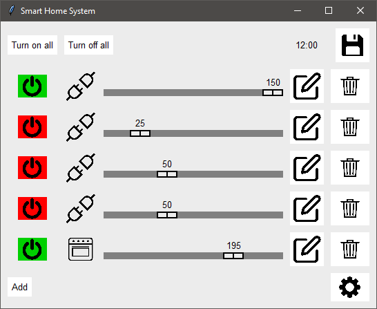

#### Edit Devices Menu
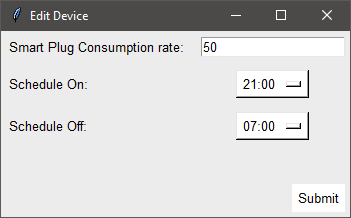

#### New Device Menu
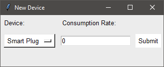

### Interface & Accessibility Settings

Functioning Accessibility Settings such as, a light and dark mode, a custom colour scheme that you can choose and changing the character size.

#### Settings
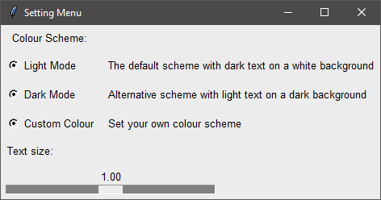

#### Dark Mode
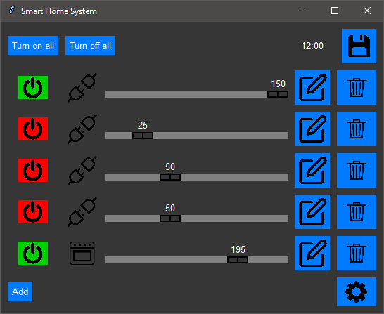

#### Custom Colour Scheme
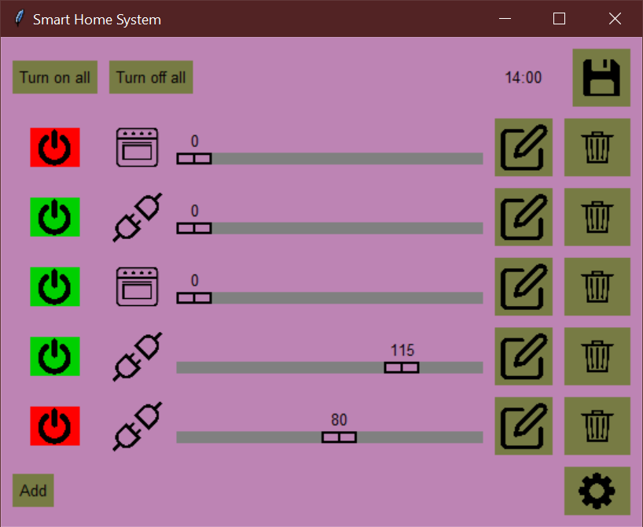

#### Custom Colour Scheme Settings
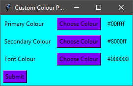

#### Large Font Size


#### Font Settings
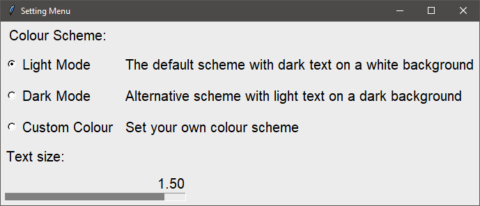

### Error Messages

Appropriate error messages were given in case of wrong input type / submitting before choosing an option.

#### Example 1
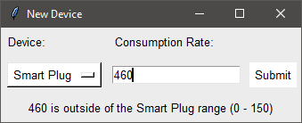

#### Example 2
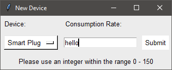

#### Example 3
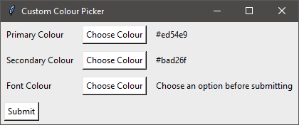


### Permanent Data Storage

Allows you to save the state of your current 'Smart Home' and upload a previously saved state.

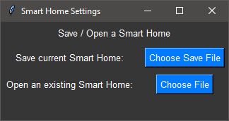

### Device Scheduler

Lets you set specific times for devices to turn on or off automatically.

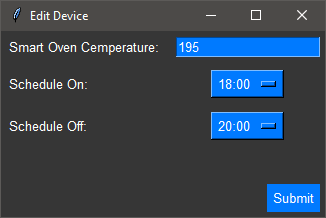

## Requirements

* Python 3

This project uses __Tkinter__ which is a standard python package that comes pre-installed with Python.
If you're on windows, you can skip straight to the usage section.

### If ran on Mac

Mac Tkinter faces an issue that has yet to have been fixed where the Button widget's background can't be changed. The only work-around to this issue is by installing a extension for Tkinter, [tkmacosx](https://pypi.org/project/tkmacosx/), and importing the [Button widget](https://github.com/Saadmairaj/tkmacosx#button-widget). This solves the issue and allows the Button to function as normal.

#### If ran on Mac without tkmacosx:
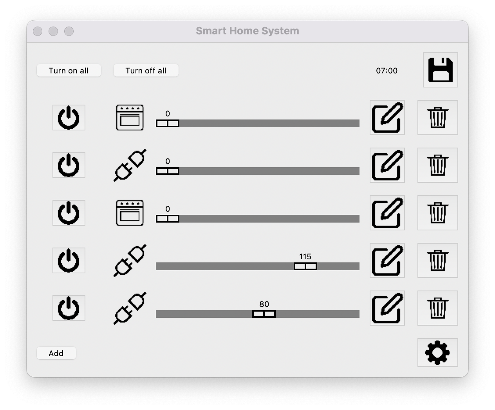

#### Dark Mode
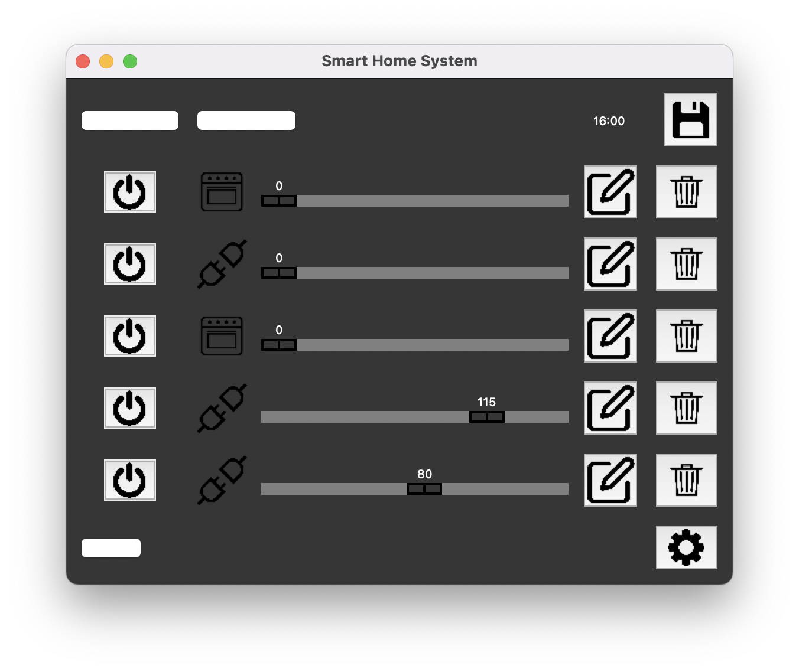

#### How it should look:
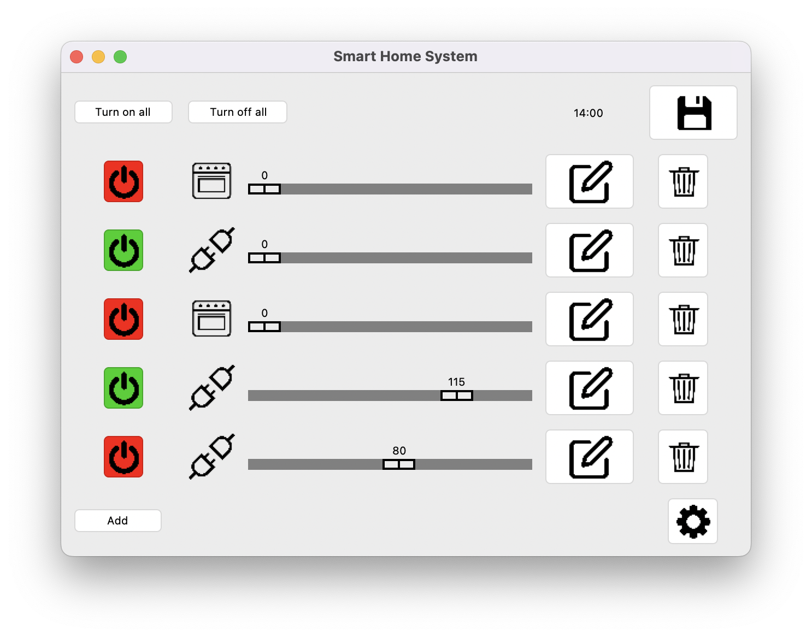

#### Dark mode
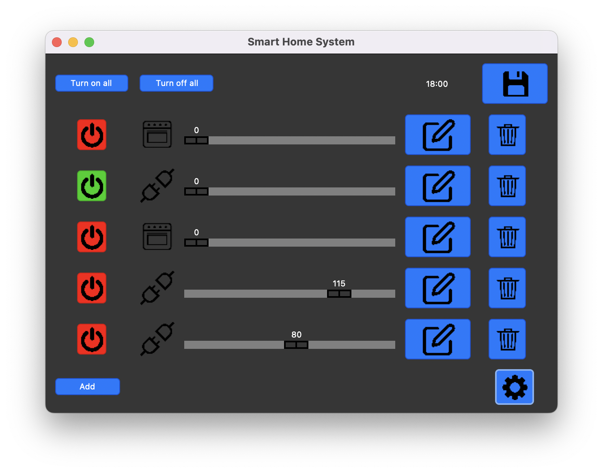

### Installation

To install, run the following command in the shell:

```
pip install tkmacosx
```

After installing tkmacosx, you'll need to run the Mac specified [Frontend File](./frontendMac.py).

## Usage

1. Clone this project
2. If on Mac, [install tkmacosx](#If-ran-on-Mac)
3. Run [__frontend.py__](./frontend.py), if on Mac; Run [__frontendMac.py__](./frontendMac.py)
4. Enter 5 devices

### Input

Upon running the program, the user is prompted via the shell to enter:

1. The __device__ the user would like to add (Smart Plug or Smart Oven)
2. The consumption rate if 'Smart Plug' was chosen (the rate of power consumption)

#### This is repeated 5 times.
Afterwards, the user will be able to manage their Smart Home to their liking.

## Thank you for reading 👋
