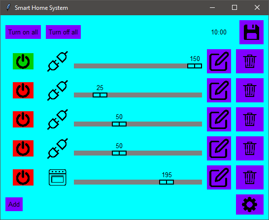
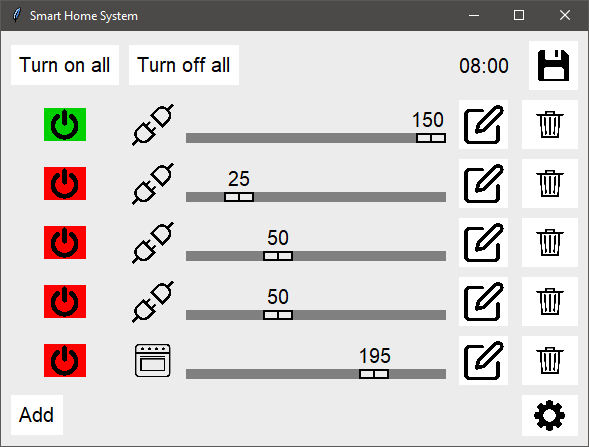

# Programming Coursework Smart Home App

A Smart Home app protoype written in Python using the Tkinter Graphical User Interface. This was submitted as the second piece of coursework for the first-year Programming module at the University of Portsmouth.

## Table of contents

- [Main Features](#main-features)
  - [Fully Interactive GUI ](#fully-interactive-gui )
  - [Interface & Accessibility Settings](#Interface-&-Accessibility-Settings)
  - [Permanent Data Storage](#Permanent-Data-Storage)
  - [Device Scheduler](#Device-Scheduler)
- [My process](#my-process)
  - [Built with](#built-with)
  - [What I learned](#what-i-learned)

## Main Features

### Fully Interactive GUI 

A fully interactive and working app where you can add, edit and remove devices from your 'Smart Home.

#### Main Menu


#### Edit Devices Menu


#### New Device Menu


### Interface & Accessibility Settings

Functioning Accessibility Settings such as, a light and dark mode, a custom colour scheme that you can choose and changing the character size.

#### Settings


#### Dark Mode


#### Custom Colour Scheme


#### Custom Colour Scheme Settings


#### Large Font Size


#### Font Settings


#### Settings


### Permanent Data Storage

Allows you to save the state of your current 'Smart Home' and upload a previously saved state.


### Device Scheduler

Lets you set specific times for devices to turn on or off automatically.


#### Pre-Defined Layout

All patchwork samples have a layout which determines the arrangement and colouring of patch designs. This layout was determined by our student numbers and so is pre-defined here.

### Patches

Individual patches are 100 × 100 in size and contain one of two geometric designs comprising several shapes, as determined by the layout.

### Input

Upon running the program, the user is prompted via the shell to enter:

* The __device__ the user would like to add (Smart Plug or Smart Oven)
* The consumption rate if 'Smart Plug' was chosen (the rate of power consumption)

#### Valid Sizes

Valid sizes for the patchwork samples are __5 × 5__, __7 × 7__, or __9 × 9__. These are multiplied by 100 to give the dimensions of the window.

The expected input is just one number that will be the common value for both the width and height.

#### Valid Colours

Valid colours for the patches are __blue__, __green__, __magenta__, __orange__, __pink__, or __red__.

### Editing

After a patchwork sample has been drawn, the user is able to interact with the patches it contains. They may select an individual patch by clicking on it and then pressing the following keys:

* if the selected patch has not been deleted:
    * the 'Enter' key to deselect the patch
    * the 's' key to switch the patch design to the other
    * the 'd' key to delete the patch, leaving an empty space
    
* if the selected patch has been deleted:
    * the key for the first letter of a valid colour to create a new patch with the second design of this colour
        * e.g. 'r' for 'red'

Other keys have no effect on a selected patch. When selected, a patch will show a thick black border.

## Requirements

* Python 3

This project uses Tkinter which is a standard python package that comes pre-installed with Python

### If ran on Mac

Mac Tkinter faces an issue that has yet to have been fixed where the Button widget's background can't be changed. The only work-around to this issue is by installing a extension for Tkinter, [tkmacosx](https://pypi.org/project/tkmacosx/), and importing the [Button widget](https://github.com/Saadmairaj/tkmacosx#button-widget). This solves the issue and allows the Button to function as normal.

If ran on Mac without tkmacosx:


#### Installation

To install, run the following command in the shell:

```
pip install tkmacosx
```

After installing tkmacosx, you'll need to run the Mac specified frontend.py

## Usage

To use the Smart Home GUI, run __frontend.py__.
